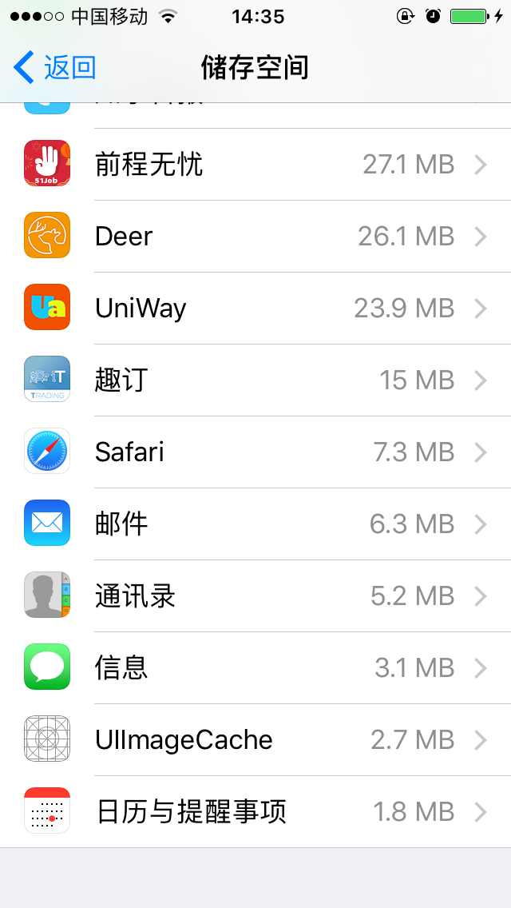
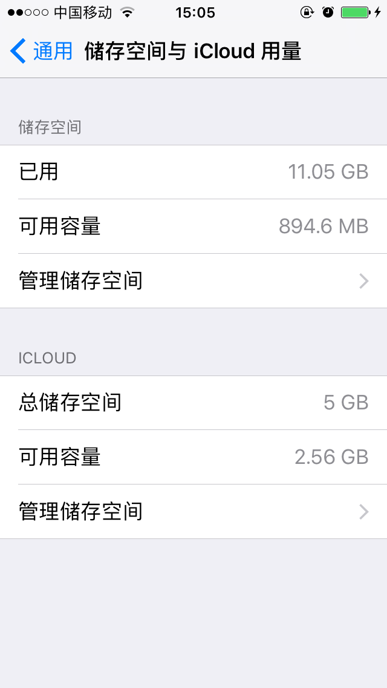
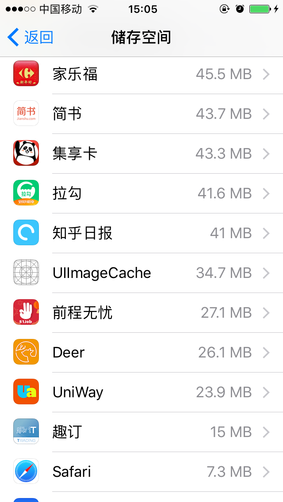

# hello-girl-iOS
练习iOS，疑问：[UIImage imageWithData:]会把图片数据保存在手机磁盘么？  
场景：用一个UIImageView展示图片，图片不断从服务器获取，不断覆盖UIImageView的``image``属性。  
那么问题来了：每一张图片是通过URL获取data，然后使用``[UIImage imageWithData:]``实例化一个UIImage对象，最后把这个对象复制给UIImageView的``image``属性。这样会不会导致设备的磁盘（注意不是内存）爆满？  
**目前还在测试中，尚无结论，有待进一步研究，欢迎讨论**
###说明
此Demo的后台数据使用一个[小爬虫](https://github.com/blackmatch/hello-girl)实现，仅供学习使用。
###预览

###测试
设备：iPhone5S  
方法：自动播放图片500张以上，对比前后APP占用空间  
####测试前情况：  

  
####测试完成情况：

###测试结果分析
完成测试后，**程序占用的磁盘空间从2.7M变成34.7M**  
初步结论：**[UIImage imageWithData:]会占用设备的存储空间**  
进一步探讨：UIImage通过``[UIImage imageWithData:]``实例化对象后是如何存储数据的？有没有限制？之前有网友通过socket以每秒30张图片的频率来实现视频播放，结果十分钟左右就占用了几个G的存储空间，能否进一步证实这个结论？有没有办法不存储图片数据呢？欢迎大家讨论。不足之处还请不吝赐教。